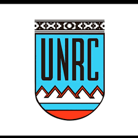

**Departamento de Computación**  
**Asignatura: Ingeniería de Software II (Cód. 3387)**  
**Año 2026**

# Guia de Trabajo Practico

## 1. INTRODUCCION
En el presente documento se explican y analizan los requerimientos del proyecto SIUA *(Sistema Integral Universitario Académico)*, desarrollado para la materia Ingeniería del Software II de la carrera de Analista en Computación.

---

### 1.1 Propósito
Este documento tiene como finalidad dar a conocer el funcionamiento general del proyecto SIUA *(Sistema Integral Universitario Académico)*, el cual representa la continuación del proyecto iniciado en la materia correlativa Ingeniería del Software I.

#### 1.2 Contexto del Sistema
- **Nombre del Sistema**: SIUA *(Sistema Integral Universitario Académico)*.  
- El sistema está destinado a la gestión de procesos administrativos y académicos de una institución educativa. Permitirá el alta, baja y modificación de profesores, alumnos y personal administrativo (con rol de administrador), así como también la gestión de materias de distintas carreras.
- El principal beneficiario del sistema serán las instituciones educativas que lo implementen. El objetivo es sistematizar y optimizar los procesos administrativos y académicos en términos de tiempo y recursos.

#### 1.3 Usuarios a los que está dirigido
El sistema está dirigido principalmente a tres tipos de usuarios:

- **Administrador**: Personal administrativo encargado de gestionar cuentas de profesores y alumnos (alta, baja y modificación), administrar materias, asignar docentes y coordinar su relación con carreras o áreas. También será responsable del reseteo de contraseñas en caso de inconvenientes.

- **Profesores**: Podrán gestionar las materias a su cargo (una o varias), visualizar los estudiantes inscriptos y administrar información académica como calificaciones, tareas y consultas de los alumnos.

- **Alumnos**: Podrán inscribirse y darse de baja en materias, consultar notas, visualizar su información académica (promedio, historial de materias) y realizar consultas a los profesores.

#### 1.4 Funcionalidades Principales

- Gestión de usuarios administrativos (alta, modificación y baja).
- Gestión de usuarios profesores (alta, modificación y baja).
- Gestión de usuarios estudiantes (alta, modificación y baja).
- Límite de intentos de login (máximo 3 intentos).
- Sistema de recuperación de contraseñas mediante intervención del administrador.
- Implementación de roles diferenciados (*alumno*, *profesor*, *administrador*).
- Gestión de materias (alta, modificación y baja), incluyendo:
  - Nombre y código
  - Profesor responsable
  - Estudiantes inscriptos
  - Calificaciones
- Filtros en la creación de cuentas.
- Paneles (dashboards) diferenciados según el rol del usuario.
- Sistema de consultas o quejas de alumnos hacia profesores.
- Cálculo automático del promedio del alumno.
- Visualización del historial académico del alumno.
- Generación y gestión de una base de datos adecuada.
- Expiración automática de sesiones por inactividad.

#### 1.5 Tecnologías Elegidas

El proyecto será desarrollado principalmente utilizando el lenguaje **Java**, apoyándose en el framework **Spark Framework** para la construcción de la capa web.

Para la implementación de las vistas se empleará el motor de plantillas **Mustache**, permitiendo la generación dinámica de contenido HTML.

En cuanto a la persistencia de datos, se utilizará una base de datos liviana **SQLite**, adecuada para entornos de desarrollo y pruebas. La interacción con la base de datos se gestionará mediante el framework **ActiveJDBC**, facilitando el acceso y manipulación de datos a través del patrón Active Record.

La seguridad de contraseñas será gestionada mediante el uso de **BCrypt**, mientras que la gestión de sesiones será manejada mediante los mecanismos provistos por **Spark Framework**.

El código fuente será versionado utilizando **GitHub**, y la gestión del proyecto se realizará mediante **GitHub Projects**.

#### 1.6 Restricciones Técnicas

- **Lenguaje y Framework**: El sistema deberá desarrollarse utilizando **Java** y **Spark Framework**, limitando el uso de otras tecnologías backend.
- **Motor de Base de Datos**: Se utilizará **SQLite**, lo cual implica limitaciones en concurrencia y escalabilidad.
- **Acceso a Datos**: Se utilizará **ActiveJDBC** siguiendo el patrón Active Record.
- **Gestión de Concurrencia**: Se deberá limitar la cantidad de conexiones simultáneas para evitar bloqueos en la base de datos.
- **Arquitectura Web**: Se utilizará un servidor web liviano basado en Spark, sin frameworks empresariales como Spring.
- **Motor de Vistas**: Se utilizará **Mustache**, manteniendo separación entre lógica de negocio y presentación.
- **Seguridad**:
  - Límite de intentos de login (máximo 3).
  - Reseteo de contraseñas gestionado por el administrador.
  - Uso de **BCrypt** para almacenamiento seguro de contraseñas.
- **Sesiones**: Implementación de expiración automática por inactividad.
- **Despliegue**: El sistema se ejecutará en entorno local (puerto 8080), sin despliegue en servidores externos.
- **Escalabilidad**: El sistema está orientado a entornos académicos de pequeña o mediana escala.
- **Compatibilidad**: Accesible desde navegadores web modernos (Chrome, Firefox, Edge, entre otros).

### 1.7 Tamaño del equipo y Plazo estimado

El equipo de desarrollo está conformado por **5 integrantes**, estimando un plazo de desarrollo de aproximadamente **2 meses**.

### 1.8 Cambios de alcance ocurridos

Durante el desarrollo del proyecto se identificaron cambios en el alcance inicial:

- Se descartó la implementación de recuperación de contraseña mediante envío de correo electrónico debido a su complejidad técnica.
- En su lugar, se optó por un mecanismo en el cual el **administrador puede resetear contraseñas manualmente**.
- Se incorporaron nuevas funcionalidades como:
  - Sistema de consultas de alumnos a profesores.
  - Expiración automática de sesiones.
  - Estadísticas académicas para profesores.